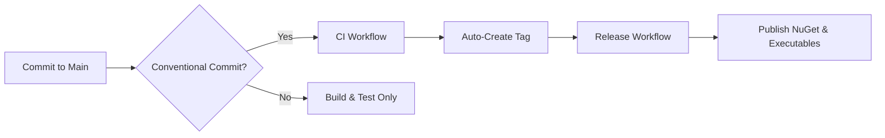

# QuickApiMapper CI/CD Quick Reference

## Automated Release Workflow



## Conventional Commit Cheat Sheet

### Version Bumps

| Commit Prefix | Example | Version | Release |
|---------------|---------|---------|---------|
| `feat:` | `feat: add auth` | 0.1.0 → **0.2.0** | |
| `fix:` | `fix: null check` | 0.1.0 → **0.1.1** | |
| `perf:` | `perf: cache` | 0.1.0 → **0.1.1** | |
| `feat!:` | `feat!: new API` | 0.1.0 → **1.0.0** | |
| `docs:` | `docs: readme` | **No change** | |
| `chore:` | `chore: deps` | **No change** | |
| `test:` | `test: unit tests` | **No change** | |

### Quick Examples

```bash
# Triggers MINOR release (0.1.0 → 0.2.0)
git commit -m "feat: add message capture"

# Triggers PATCH release (0.1.0 → 0.1.1)
git commit -m "fix: resolve memory leak"

# Triggers MAJOR release (0.1.0 → 1.0.0)
git commit -m "feat!: redesign API"

# No release (build & test only)
git commit -m "docs: update README"
```

## 🔄 Development Workflow

### 1️⃣ Create Feature Branch

```bash
git checkout -b feature/my-feature
```

### 2️⃣ Make Changes

```bash
# Write code, add tests
git add .
git commit -m "feat: add my feature"
```

### 3️⃣ Push and Create PR

```bash
git push origin feature/my-feature
# Create PR on GitHub
# Wait for validation 
```

### 4️⃣ Merge to Main

```bash
# Use "Squash and Merge"
# Ensure squash commit follows conventional commits
# Example: "feat: add my feature"
```

### 5️⃣ Automatic Release 

```
Main ← Squash Merge
 ↓
CI Workflow (Build & Test)
 ↓
Auto-Tag (v0.2.0)
 ↓
Release Workflow (Publish)
 ↓
 NuGet.org + GitHub Release
```

## What Happens When?

### On Pull Request

```
PR Created/Updated
 → PR Validation Workflow
 → Build solution
 → Run tests
 → Dry-run package creation
 → Dry-run executable publishing
 → Post summary comment
 → Upload dry-run artifacts
```

### On Merge to Main

```
Merge to Main
 → CI Workflow
 → Build & test
 → Create packages
 → Publish executables (Linux, Windows)
 → Analyze commits
 → Create tag if conventional commit detected
 → Triggers Release Workflow
 → Publish to NuGet.org
 → Create GitHub Release
 → Publish to GitHub Packages
```

### On Tag Creation (Manual)

```
git tag v0.1.0
git push origin v0.1.0
 → Release Workflow
 → Full release pipeline
```

## ️ Version Format

- **Format**: `v{Major}.{Minor}.{Patch}[-{PreRelease}]`
- **Examples**:
 - `v0.1.0` - Initial release
 - `v0.2.0` - Feature added
 - `v0.2.1` - Bug fixed
 - `v1.0.0` - Breaking change
 - `v1.0.0-alpha.1` - Pre-release

## What Gets Published?

### NuGet Packages (13 packages)

- QuickApiMapper.Contracts
- QuickApiMapper.Application
- QuickApiMapper.Behaviors
- QuickApiMapper.Persistence.Abstractions
- QuickApiMapper.Persistence.PostgreSQL
- QuickApiMapper.Persistence.SQLite
- QuickApiMapper.MessageCapture.Abstractions
- QuickApiMapper.MessageCapture.InMemory
- QuickApiMapper.Extensions.gRPC
- QuickApiMapper.Extensions.RabbitMQ
- QuickApiMapper.Extensions.ServiceBus
- QuickApiMapper.StandardTransformers
- QuickApiMapper.CustomTransformers

### Executables (3 apps × 6 platforms = 18 executables)

**Platforms**: Linux (x64, ARM64), Windows (x64, ARM64), macOS (x64, ARM64)

**Applications**:
- QuickApiMapper.Management.Api
- QuickApiMapper.Web
- QuickApiMapper.Designer.Web

## ⚠️ Important Notes

### DO

- Use conventional commit prefixes
- Let PR validation complete before merging
- Squash merge PRs with proper commit message
- Review dry-run artifacts in PRs
- Write tests for new features

### DON'T

- Manually create tags (unless necessary)
- Force-push to main branch
- Merge PRs with failing checks
- Use vague commit messages
- Skip tests

## Troubleshooting

### Release Not Triggered

**Problem**: Merged to main but no release created

**Check**:
1. Did you use a conventional commit prefix? (`feat:`, `fix:`, etc.)
2. Did CI workflow complete successfully?
3. Check CI logs for "Auto-Tag Summary"

**Fix**:
```bash
# If needed, manually create tag to trigger release
git tag v0.1.0
git push origin v0.1.0
```

### Version Not Bumping

**Problem**: Tag created but version is wrong

**Check**:
1. Run `nbgv get-version` locally to see calculated version
2. Check `version.json` for base version
3. Verify tag format matches `v*` pattern

### Build Failing

**Problem**: CI workflow fails

**Check**:
1. Review CI logs in Actions tab
2. Run tests locally: `dotnet test`
3. Check for dependency issues
4. Ensure .NET 10 SDK is installed

## More Information

- **Full Workflow Documentation**: [.github/workflows/README.md](.github/workflows/README.md)
- **Contributing Guide**: [CONTRIBUTING.md](../CONTRIBUTING.md)
- **Conventional Commits**: https://www.conventionalcommits.org/
- **Nerdbank.GitVersioning**: https://github.com/dotnet/Nerdbank.GitVersioning

## Learning Path

1. Read this quick reference
2. Review CONTRIBUTING.md
3. Create a test branch and PR
4. Use conventional commits
5. Observe automated workflows
6. Start contributing!
