# QuickApiMapper Demo Architecture

Visual architecture documentation using Mermaid diagrams to illustrate data flows, component interactions, and transformation workflows.

## Table of Contents

- [System Overview](#system-overview)
- [Component Architecture](#component-architecture)
- [Data Flow Diagrams](#data-flow-diagrams)
- [Sequence Diagrams](#sequence-diagrams)
- [Deployment Architecture](#deployment-architecture)
- [Integration Patterns](#integration-patterns)

## System Overview

### High-Level Architecture

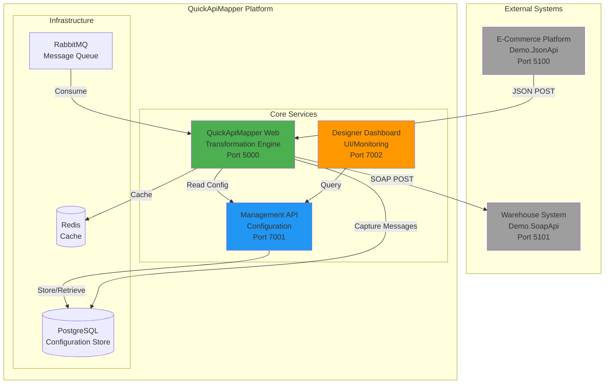

### Demo Ecosystem

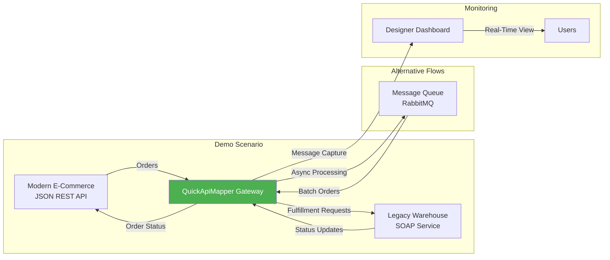

## Component Architecture

### QuickApiMapper Core Components

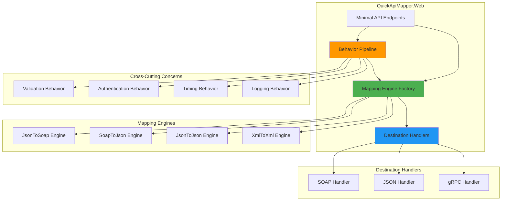

### Management & Designer Stack

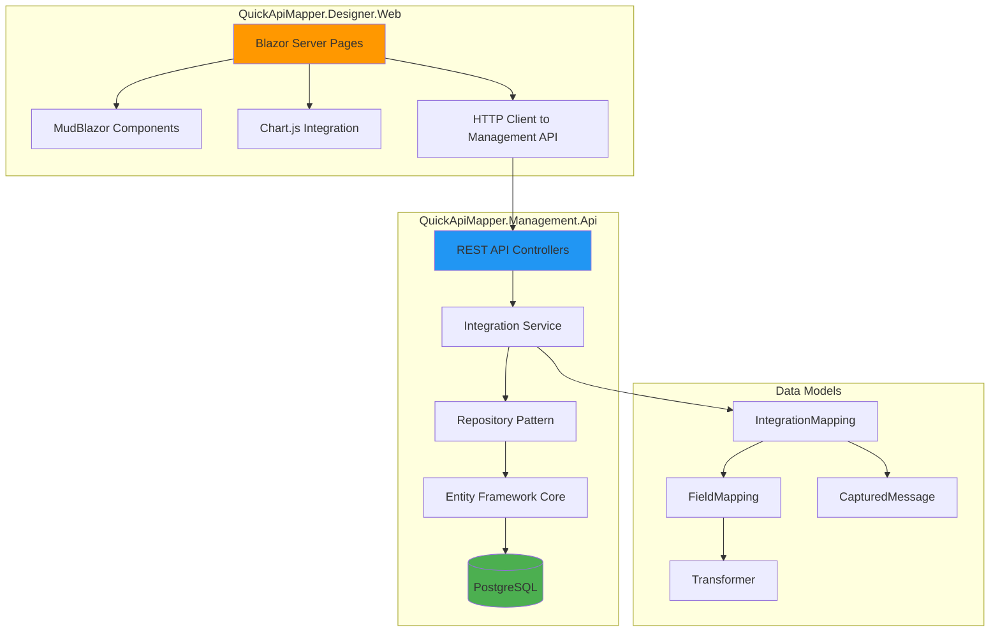

## Data Flow Diagrams

### JSON to SOAP Transformation Flow

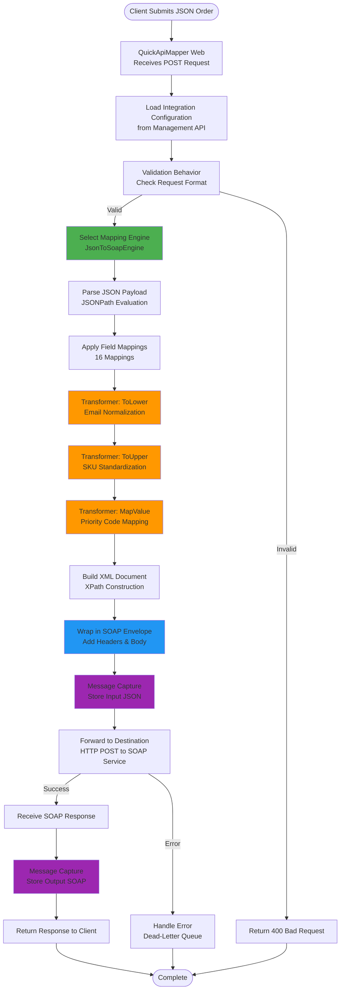

### SOAP to JSON Transformation Flow

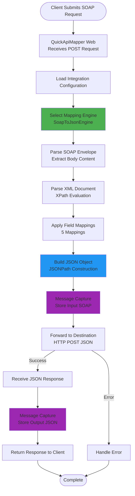

### RabbitMQ Worker Processing Flow

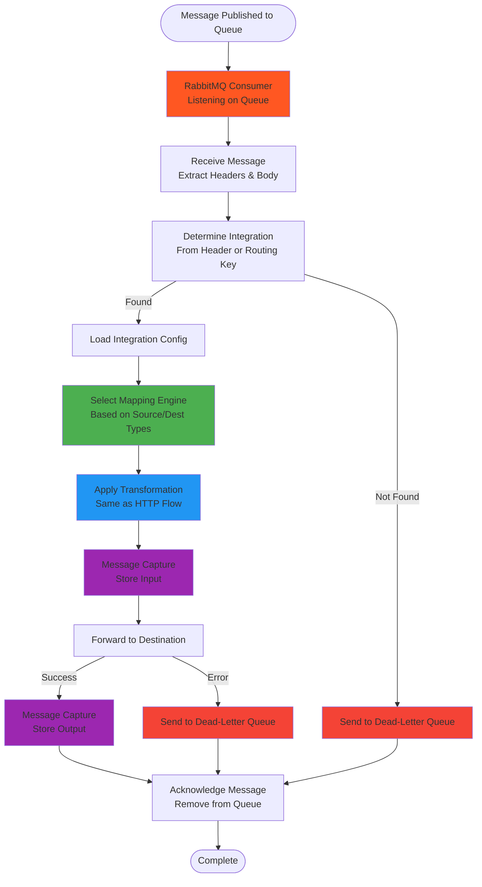

## Sequence Diagrams

### End-to-End Order Processing

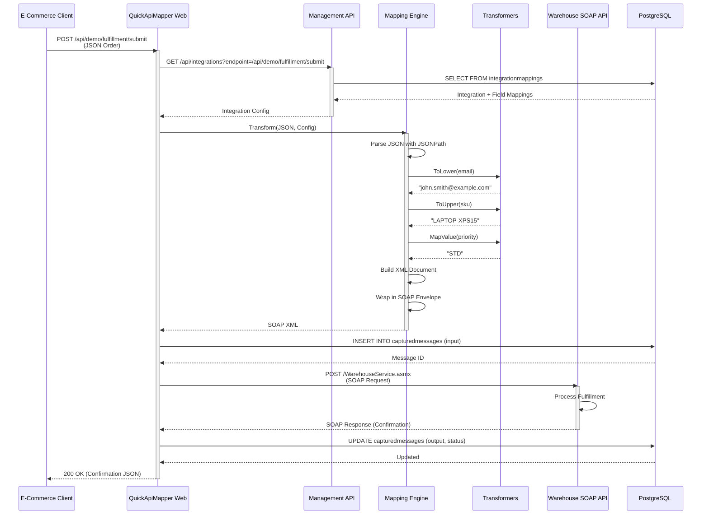

### Designer Dashboard Query Flow

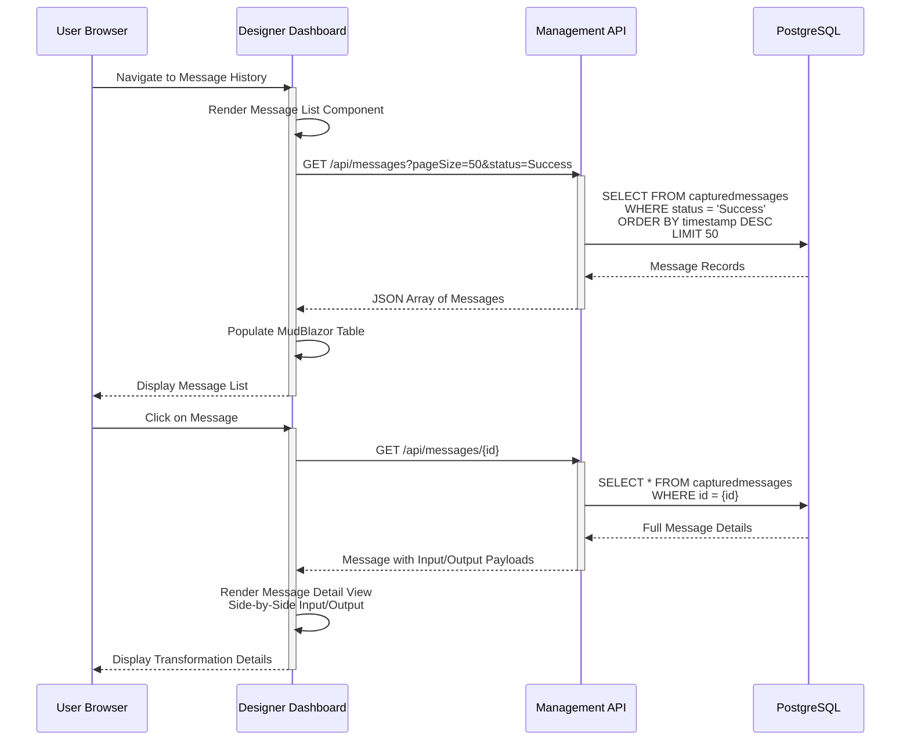

### RabbitMQ Message Processing

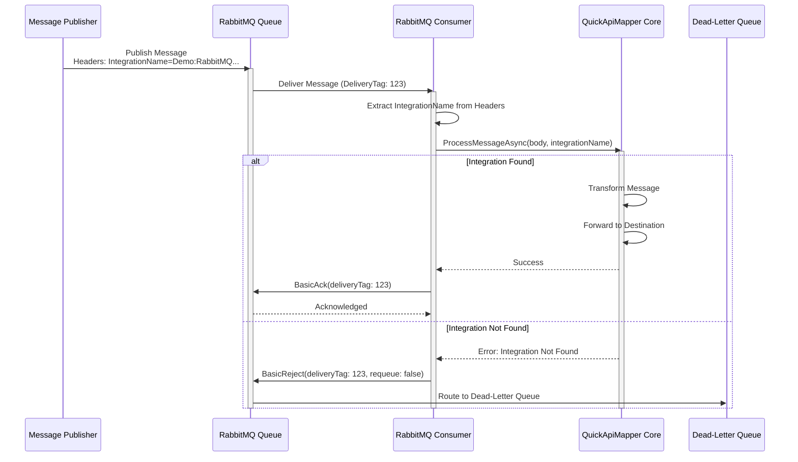

## Deployment Architecture

### Aspire Orchestration

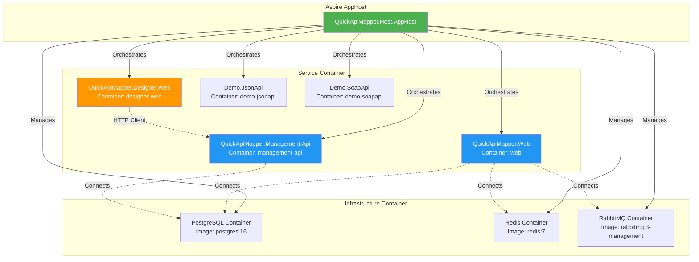

### Network Flow

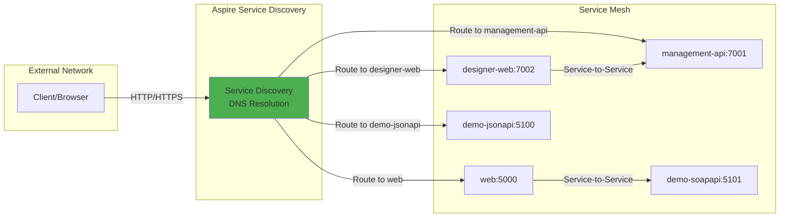

## Integration Patterns

### Synchronous HTTP Integration Pattern

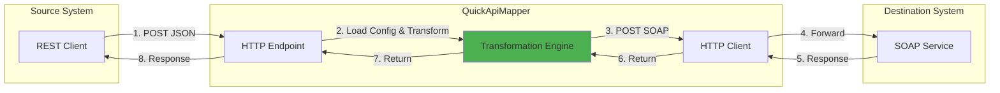

### Asynchronous Message Queue Pattern

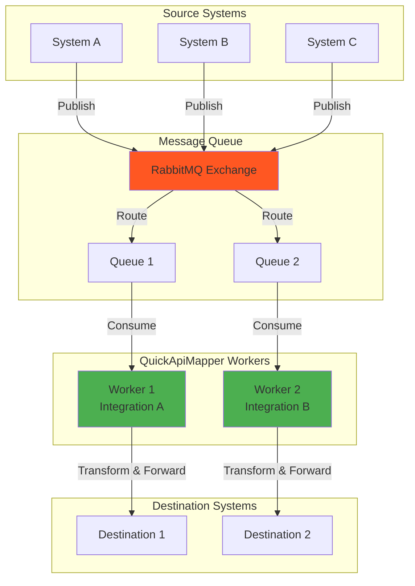

### Bi-Directional Integration Pattern

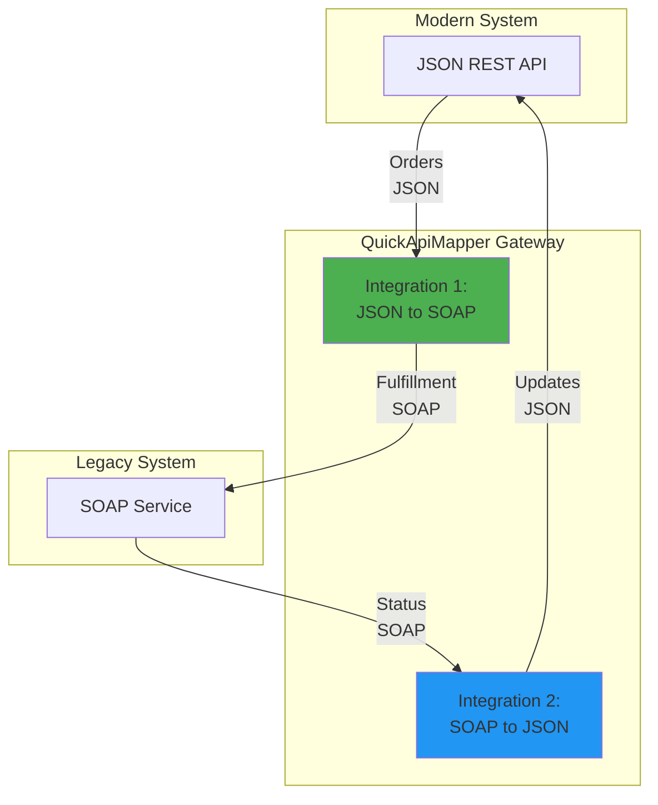

### Hybrid Integration Pattern (HTTP + Queue)

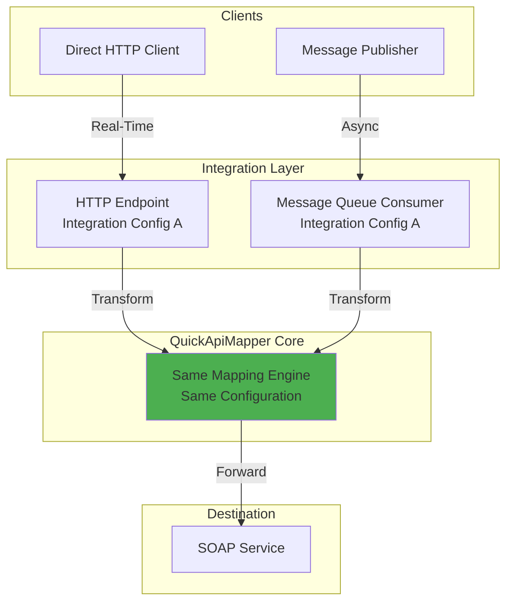

### Transformation Pipeline

```mermaid
graph LR
    Input[Input Payload] --> Parse[Parse<br/>JSON/XML/SOAP]
    Parse --> Map[Apply Field Mappings<br/>JSONPath/XPath]
    Map --> T1[Transformer 1<br/>ToLower]
    T1 --> T2[Transformer 2<br/>ToUpper]
    T2 --> T3[Transformer 3<br/>MapValue]
    T3 --> Build[Build Output<br/>JSON/XML/SOAP]
    Build --> Envelope[Wrap in Envelope<br/>if SOAP]
    Envelope --> Output[Output Payload]

    style Map fill:#4CAF50
    style T1 fill:#FF9800
    style T2 fill:#FF9800
    style T3 fill:#FF9800
    style Build fill:#2196F3
```

---

**Document Version**: 1.0
**Last Updated**: 2026-01-11
**Related Documents**: [DEMO_GUIDE.md](DEMO_GUIDE.md), [DEMO_IMPLEMENTATION_PLAN.md](DEMO_IMPLEMENTATION_PLAN.md)
