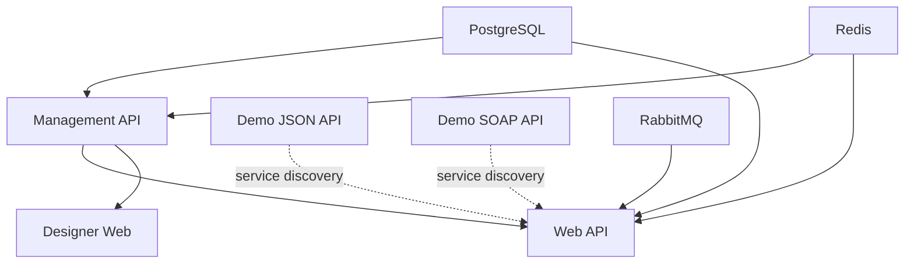

# QuickApiMapper Aspire AppHost

This is the .NET Aspire AppHost orchestration project that manages all QuickApiMapper services and their dependencies.

## Overview

The AppHost coordinates the startup and configuration of:
- Infrastructure services (PostgreSQL, Redis, RabbitMQ)
- Demo services (JSON API, SOAP API)
- QuickApiMapper services (Management API, Web API, Designer Web)

## Running the Application

From the repository root:

```bash
cd src/QuickApiMapper.Host.AppHost
dotnet run
```

The Aspire Dashboard will open automatically in your browser (typically at https://localhost:15001).

## Service Architecture

### Startup Order

1. **Infrastructure Layer** (starts first, in parallel):
   - PostgreSQL with PgAdmin
   - Redis
   - RabbitMQ with Management Plugin

2. **Demo Services** (standalone, no dependencies):
   - Demo JSON API (modern e-commerce order API)
   - Demo SOAP API (legacy warehouse/ERP system)

3. **Management API** (after infrastructure):
   - Central configuration service
   - Auto-seeds demo data in Development environment
   - Manages integration mappings

4. **Application Services** (after dependencies):
   - QuickApiMapper Web API (after Management API + Demo services)
   - Designer Web UI (after Management API)

### Service Dependencies



## Services

### Infrastructure Services

#### PostgreSQL
- **Name**: `postgres`
- **Database**: `quickapimapper-db`
- **Features**: PgAdmin web interface
- **Used by**: Management API, Web API

#### Redis
- **Name**: `redis`
- **Used by**: Management API, Web API
- **Purpose**: Caching and session storage

#### RabbitMQ
- **Name**: `rabbitmq`
- **Features**: Management Plugin UI
- **Used by**: Web API
- **Purpose**: Message queuing for async processing

### Demo Services

#### Demo JSON API
- **Name**: `demo-jsonapi`
- **Purpose**: Simulates a modern e-commerce order API
- **Protocol**: REST/JSON
- **Endpoints**:
  - `POST /api/orders` - Submit new order
  - `GET /api/orders` - List all orders
  - `GET /api/orders/{id}` - Get specific order
  - `PUT /api/orders/{id}/status` - Update order status
- **Health Check**: `/health`
- **Documentation**: Scalar UI at root
- **Dependencies**: None (standalone)

#### Demo SOAP API
- **Name**: `demo-soapapi`
- **Purpose**: Simulates a legacy warehouse/ERP system
- **Protocol**: SOAP 1.1 / SOAP 1.2
- **Operations**:
  - `SubmitFulfillmentRequest` - Create fulfillment
  - `GetFulfillmentStatus` - Query fulfillment status
  - `CancelFulfillment` - Cancel a fulfillment
- **WSDL**: `/WarehouseService.asmx?wsdl`
- **Health Check**: `/health`
- **Dependencies**: None (standalone)

### Application Services

#### Management API
- **Name**: `management-api`
- **Purpose**: Central configuration and administration
- **Endpoints**: RESTful API for managing integrations
- **Health Check**: `/health`
- **Dependencies**: PostgreSQL, Redis
- **Demo Mode**: Enabled in Development (see below)

#### Web API
- **Name**: `web-api`
- **Purpose**: Main integration mapping service
- **Features**:
  - JSON-to-SOAP transformations
  - Service discovery to demo services
  - Message capture and logging
- **Health Check**: `/health`
- **Dependencies**: PostgreSQL, Redis, RabbitMQ, Demo services (via service discovery)

#### Designer Web
- **Name**: `designer-web`
- **Purpose**: Visual UI for creating integration mappings
- **Type**: Blazor Server application
- **Health Check**: `/health`
- **Dependencies**: Management API

## Demo Mode Configuration

In Development environment, the Management API is automatically configured with demo mode enabled:

```csharp
if (builder.Environment.EnvironmentName == "Development")
{
    managementApi.WithEnvironment("DemoMode__EnableDemoMode", "true");
    managementApi.WithEnvironment("DemoMode__ForceReseed", "false");
    managementApi.WithEnvironment("DemoMode__SampleMessageCount", "15");
    managementApi.WithEnvironment("DemoMode__FailedMessageCount", "3");
}
```

### What Demo Mode Does

1. **Auto-seeds demo integration mappings** connecting:
   - Demo JSON API (source) → Demo SOAP API (target)
   - Example: Order submission JSON → Fulfillment SOAP request

2. **Creates sample message history** showing:
   - 15 successful transformations
   - 3 failed transformations for testing error handling

3. **Pre-configures endpoints** for immediate testing

### Demo Data Flow

```
Client Request (JSON)
    ↓
Demo JSON API
    ↓ (receives order)
QuickApiMapper Web API
    ↓ (transforms JSON → SOAP)
Demo SOAP API
    ↓ (processes fulfillment)
Response (SOAP → JSON)
    ↓
Client
```

## Service Discovery

The Aspire service discovery mechanism allows services to find each other by name:

### How It Works

1. **Infrastructure services** are referenced via connection strings:
   ```csharp
   .WithReference(postgres)  // Injects ConnectionStrings__postgres
   .WithReference(redis)     // Injects ConnectionStrings__redis
   .WithReference(rabbitmq)  // Injects ConnectionStrings__rabbitmq
   ```

2. **Demo services** are referenced for service discovery:
   ```csharp
   .WithReference(demoJsonApi)  // Enables discovery of demo-jsonapi
   .WithReference(demoSoapApi)  // Enables discovery of demo-soapapi
   ```

3. **Services use HttpClient** with service discovery:
   ```csharp
   // In application code
   httpClient.GetAsync("http://demo-jsonapi/api/orders")
   httpClient.PostAsync("http://demo-soapapi/WarehouseService.asmx", ...)
   ```

### Service Defaults

All services reference `QuickApiMapper.Host.ServiceDefaults` which provides:
- Service discovery configuration
- Health check endpoints (`/health`, `/alive`)
- OpenTelemetry instrumentation
- Standard resilience patterns

## Health Checks

All services expose health check endpoints:

- **Primary**: `/health` - Overall health
- **Liveness**: `/alive` - Service is running

Health checks are monitored by:
- Aspire Dashboard (visual status)
- AppHost orchestration (startup dependencies)

## Monitoring & Observability

The Aspire Dashboard provides:

1. **Service Status**: Real-time health of all services
2. **Logs**: Structured logging from all services
3. **Traces**: Distributed tracing across service calls
4. **Metrics**: Performance metrics and resource usage
5. **Console Output**: Direct access to service console logs

## External Endpoints

Services configured with `.WithExternalHttpEndpoints()` can be accessed from outside the Aspire application:

- Demo JSON API
- Demo SOAP API
- Management API
- Web API
- Designer Web

Port assignments are shown in the Aspire Dashboard.

## Development Workflow

### First Run

1. Start AppHost: `dotnet run`
2. Wait for Aspire Dashboard to open
3. Verify all services are healthy (green status)
4. Note the assigned ports in the dashboard

### Accessing Services

- **Aspire Dashboard**: Check console output for URL (typically https://localhost:15001)
- **Individual Services**: Click service name in dashboard to see endpoints
- **Demo JSON API**: Navigate to assigned port for Scalar documentation
- **Demo SOAP API**: Navigate to `/WarehouseService.asmx?wsdl` for WSDL
- **Designer Web**: Visual UI for creating mappings

### Testing Demo Flow

1. Open Designer Web (get URL from Aspire Dashboard)
2. View pre-seeded demo mappings
3. Test transformations via Web API
4. Monitor request flow in Aspire Dashboard traces

## Configuration

### Environment Variables

Set in `AppHost.cs` via `.WithEnvironment()`:

```csharp
.WithEnvironment("KEY", "value")
```

### Connection Strings

Automatically injected by `.WithReference()`:
- PostgreSQL: `ConnectionStrings__postgres`
- Redis: `ConnectionStrings__redis`
- RabbitMQ: `ConnectionStrings__rabbitmq`

### Logging

Configured per-service in `appsettings.json` or via environment variables:

```csharp
.WithEnvironment("Logging__LogLevel__Default", "Information")
```

## Troubleshooting

### Service Won't Start

1. Check Aspire Dashboard logs for the service
2. Verify dependencies are healthy
3. Check console output for errors
4. Ensure required ports are available

### Database Connection Issues

1. Verify PostgreSQL container is running
2. Check connection string in dashboard
3. Review Management API logs

### Demo Mode Not Working

1. Confirm `ASPNETCORE_ENVIRONMENT=Development`
2. Check Management API environment variables in dashboard
3. Review Management API logs for seeding messages

### Service Discovery Issues

1. Verify `.WithReference()` is called for dependent services
2. Check service names match exactly
3. Review Web API logs for discovery errors

## Project Structure

```
QuickApiMapper.Host.AppHost/
├── AppHost.cs                  # Main orchestration configuration
├── QuickApiMapper.Host.AppHost.csproj
├── README.md                   # This file
└── obj/                        # Build artifacts
    └── Debug/
        └── net10.0/
            └── Aspire/
                └── references/ # Generated project metadata
```

## Related Documentation

- [Aspire Documentation](https://learn.microsoft.com/dotnet/aspire/)
- [Management API Demo Mode](../QuickApiMapper.Management.Api/Data/README.md)
- [Demo JSON API](../Demo.JsonApi/README.md)
- [Demo SOAP API](../Demo.SoapApi/README.md)

## Tips & Best Practices

### Performance

- Infrastructure services start in parallel (no dependencies)
- Demo services start in parallel (no dependencies)
- Use `.WaitFor()` only when necessary for dependencies

### Development

- Use Aspire Dashboard for all monitoring
- Check health endpoints before testing
- Review traces to understand request flow
- Use PgAdmin for database inspection
- Use RabbitMQ Management UI for queue monitoring

### Production

- Disable demo mode in Production:
  ```csharp
  if (builder.Environment.EnvironmentName == "Development") { ... }
  ```
- Configure external endpoints appropriately
- Review and adjust resource limits
- Implement proper secrets management
- Configure persistent storage for databases

## Summary

The AppHost provides a complete orchestration solution that:

1. Manages infrastructure dependencies (PostgreSQL, Redis, RabbitMQ)
2. Orchestrates demo services for testing
3. Configures production services with proper dependencies
4. Enables service discovery and health monitoring
5. Auto-seeds demo data in Development
6. Provides observability via Aspire Dashboard

Simply run `dotnet run` to start the entire QuickApiMapper ecosystem!
